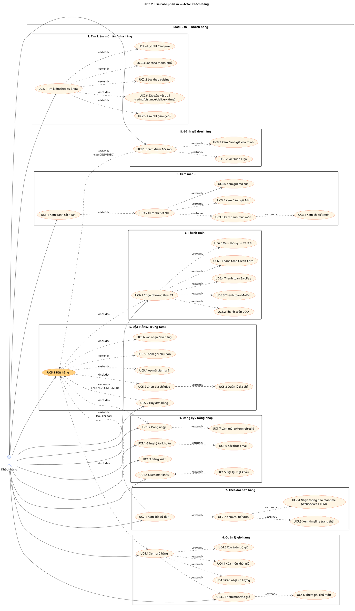
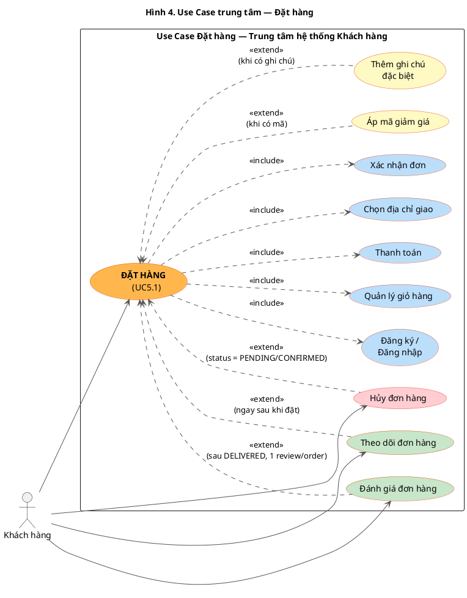

# Use Case Phân rã — FoodRush

> **Phạm vi:** Phân rã chi tiết use case cho 2 actor chính: **Khách hàng** và **Quản lý**.
> **Use case trung tâm phía Khách hàng:** `Đặt hàng` — `include` với `Đăng ký/đăng nhập`, `Quản lý giỏ hàng`, `Thanh toán`. `Theo dõi đơn hàng` và `Đánh giá đơn hàng` là use case `extend` sau khi đặt hàng.
> **Phía Quản lý:** Tập trung vận hành & kiểm soát hệ thống.

---

## 1. Biểu đồ phân rã — Actor KHÁCH HÀNG

### 1.1. PlantUML (render tại https://www.plantuml.com/plantuml/)



### 1.2. sequencediagram.org format (paste tại https://sequencediagram.org/)

```
title Hình 2. Use Case phân rã — Khách hàng

actor "Khách hàng" as KH
participant "FoodRush System" as Sys

==1. Đăng ký / Đăng nhập==
KH->Sys: UC1.1 Đăng ký tài khoản
note over KH,Sys: «include» UC1.6 Xác thực email
KH->Sys: UC1.2 Đăng nhập
note over KH,Sys: «extend» UC1.7 Làm mới token (refresh)
KH->Sys: UC1.3 Đăng xuất
KH->Sys: UC1.4 Quên mật khẩu
note over KH,Sys: «extend» UC1.5 Đặt lại mật khẩu

==2. Tìm kiếm món ăn / nhà hàng==
KH->Sys: UC2.1 Tìm kiếm theo từ khoá
note over KH,Sys: «extend»\nUC2.2 Lọc cuisine\nUC2.3 Lọc thành phố\nUC2.4 Lọc NH đang mở\nUC2.5 Tìm NH gần (geo)\n«include» UC2.6 Sắp xếp

==3. Xem menu==
KH->Sys: UC3.1 Xem danh sách NH
note over KH,Sys: «extend» UC3.2 Xem chi tiết NH
KH->Sys: UC3.2 Xem chi tiết NH
note over KH,Sys: «include» UC3.3 Xem danh mục\n«extend» UC3.4 Xem chi tiết món\n«extend» UC3.5 Xem đánh giá\n«extend» UC3.6 Xem giờ mở cửa

==4. Quản lý giỏ hàng==
KH->Sys: UC4.1 Xem giỏ hàng
KH->Sys: UC4.2 Thêm món vào giỏ
note over KH,Sys: «extend» UC4.6 Thêm ghi chú món
KH->Sys: UC4.3 Cập nhật số lượng
KH->Sys: UC4.4 Xóa món khỏi giỏ
KH->Sys: UC4.5 Xóa toàn bộ giỏ

==5. ĐẶT HÀNG (Trung tâm)==
KH->Sys: **UC5.1 Đặt hàng**
note over KH,Sys: «include»:\n- UC1.2 Đăng nhập\n- UC4.1 Quản lý giỏ hàng\n- UC5.2 Chọn địa chỉ\n- UC6.1 Thanh toán\n- UC5.6 Xác nhận\n«extend»:\n- UC5.4 Áp mã giảm giá\n- UC5.5 Thêm ghi chú đơn
KH->Sys: UC5.3 Quản lý địa chỉ
KH->Sys: UC5.7 Hủy đơn hàng
note over KH,Sys: «extend» UC5.1 Đặt hàng (PENDING/CONFIRMED)

==6. Thanh toán==
KH->Sys: UC6.1 Chọn phương thức TT
note over KH,Sys: «extend»:\n- UC6.2 COD\n- UC6.3 MoMo\n- UC6.4 ZaloPay\n- UC6.5 Credit Card
KH->Sys: UC6.6 Xem thông tin TT đơn

==7. Theo dõi đơn hàng==
KH->Sys: UC7.1 Xem lịch sử đơn
note over KH,Sys: «extend» UC5.1 Đặt hàng
KH->Sys: UC7.2 Xem chi tiết đơn
note over KH,Sys: «include» UC7.3 Xem timeline\n«extend» UC7.4 Real-time (WS+FCM)

==8. Đánh giá đơn hàng==
KH->Sys: UC8.1 Chấm điểm 1-5 sao
note over KH,Sys: «extend» UC5.1 Đặt hàng (sau DELIVERED)\n«include» UC8.2 Viết bình luận
KH->Sys: UC8.3 Xem đánh giá của mình
```

---

## 2. Biểu đồ phân rã — Actor QUẢN LÝ

### 2.1. PlantUML

```plantuml
@startuml UC_QuanLy_PhanRa
title Hình 3. Use Case phân rã — Actor Quản lý

left to right direction
skinparam packageStyle rectangle
skinparam usecase {
  BackgroundColor #E5F5E5
  BorderColor #2E8B57
  ArrowColor #555555
}
skinparam actor {
  BackgroundColor #EAF4FF
  BorderColor #2E5BE8
}

actor "Quản lý" as QL

rectangle "FoodRush — Quản lý" {

  package "1. Thống kê / Báo cáo" as MP1 {
    usecase "UC1.1 Dashboard tổng quan"   as M11
    usecase "UC1.2 Báo cáo doanh thu"     as M12
    usecase "UC1.3 Báo cáo đơn hàng"      as M13
    usecase "UC1.4 Báo cáo nhà hàng"      as M14
    usecase "UC1.5 Báo cáo người dùng"    as M15
    usecase "UC1.6 Xuất báo cáo\n(Excel/CSV/PDF)" as M16
  }

  package "2. Quản lý người dùng" as MP2 {
    usecase "UC2.1 Xem danh sách user"    as M21
    usecase "UC2.2 Xem chi tiết user"     as M22
    usecase "UC2.3 Tạo user mới"          as M23
    usecase "UC2.4 Khóa / Mở khóa user"   as M24
    usecase "UC2.5 Phân quyền (role)"     as M25
    usecase "UC2.6 Xóa user"              as M26
    usecase "UC2.7 Tìm kiếm user"         as M27
  }

  package "3. Quản lý đơn hàng" as MP3 {
    usecase "UC3.1 Xem tất cả đơn"        as M31
    usecase "UC3.2 Lọc theo trạng thái"   as M32
    usecase "UC3.3 Lọc theo ngày"         as M33
    usecase "UC3.4 Xem chi tiết đơn"      as M34
    usecase "UC3.5 Cập nhật trạng thái đơn" as M35
    usecase "UC3.6 Hủy đơn (admin)"       as M36
    usecase "UC3.7 Xuất danh sách đơn"    as M37
  }

  package "4. Quản lý menu / món ăn" as MP4 {
    usecase "UC4.1 Xem danh mục menu"      as M41
    usecase "UC4.2 Tạo danh mục"           as M42
    usecase "UC4.3 Sửa danh mục"           as M43
    usecase "UC4.4 Xóa danh mục"           as M44
    usecase "UC4.5 Xem món ăn"             as M45
    usecase "UC4.6 Thêm món ăn"            as M46
    usecase "UC4.7 Sửa món ăn"             as M47
    usecase "UC4.8 Bật / Tắt món (available)" as M48
    usecase "UC4.9 Đánh dấu featured"      as M49
    usecase "UC4.10 Upload hình ảnh"       as M410
  }

  package "5. Quản lý khuyến mãi" as MP5 {
    usecase "UC5.1 Xem danh sách mã KM"    as M51
    usecase "UC5.2 Tạo mã KM\n(PERCENTAGE/FIXED)" as M52
    usecase "UC5.3 Sửa mã KM"              as M53
    usecase "UC5.4 Bật / Tắt mã"           as M54
    usecase "UC5.5 Xóa mã KM"              as M55
    usecase "UC5.6 Xem thống kê sử dụng"   as M56
  }

  package "6. Quản lý đánh giá" as MP6 {
    usecase "UC6.1 Xem tất cả đánh giá"    as M61
    usecase "UC6.2 Lọc theo rating"        as M62
    usecase "UC6.3 Lọc theo NH"            as M63
    usecase "UC6.4 Ẩn / Hiện đánh giá"     as M64
    usecase "UC6.5 Xóa đánh giá"           as M65
    usecase "UC6.6 Phản hồi đánh giá"      as M66
  }

  package "7. Quản lý nhà hàng" as MP7 {
    usecase "UC7.1 Xem danh sách NH"       as M71
    usecase "UC7.2 Phê duyệt NH mới"       as M72
    usecase "UC7.3 Sửa thông tin NH"       as M73
    usecase "UC7.4 Bật / Tắt NH (active)"  as M74
    usecase "UC7.5 Quản lý giờ hoạt động"  as M75
    usecase "UC7.6 Xóa NH"                 as M76
    usecase "UC7.7 Xem đơn của NH"         as M77
  }
}

' Actor → main use cases
QL --> M11
QL --> M21
QL --> M31
QL --> M41
QL --> M45
QL --> M51
QL --> M61
QL --> M71

' Dashboard / báo cáo
M11 ..> M12 : <<extend>>
M11 ..> M13 : <<extend>>
M11 ..> M14 : <<extend>>
M11 ..> M15 : <<extend>>
M12 ..> M16 : <<extend>>
M13 ..> M16 : <<extend>>
M14 ..> M16 : <<extend>>
M15 ..> M16 : <<extend>>

' User mgmt
M21 ..> M22 : <<extend>>
M21 ..> M23 : <<extend>>
M21 ..> M27 : <<include>>
M22 ..> M24 : <<extend>>
M22 ..> M25 : <<extend>>
M22 ..> M26 : <<extend>>

' Order mgmt
M31 ..> M32 : <<extend>>
M31 ..> M33 : <<extend>>
M31 ..> M34 : <<extend>>
M34 ..> M35 : <<extend>>
M34 ..> M36 : <<extend>>
M31 ..> M37 : <<extend>>

' Menu mgmt
M41 ..> M42 : <<extend>>
M41 ..> M43 : <<extend>>
M41 ..> M44 : <<extend>>
M45 ..> M46 : <<extend>>
M45 ..> M47 : <<extend>>
M45 ..> M48 : <<extend>>
M45 ..> M49 : <<extend>>
M46 ..> M410 : <<include>>
M47 ..> M410 : <<include>>

' Promo mgmt
M51 ..> M52 : <<extend>>
M51 ..> M53 : <<extend>>
M51 ..> M54 : <<extend>>
M51 ..> M55 : <<extend>>
M51 ..> M56 : <<extend>>

' Review mgmt
M61 ..> M62 : <<extend>>
M61 ..> M63 : <<extend>>
M61 ..> M64 : <<extend>>
M61 ..> M65 : <<extend>>
M61 ..> M66 : <<extend>>

' Restaurant mgmt
M71 ..> M72 : <<extend>>
M71 ..> M73 : <<extend>>
M71 ..> M74 : <<extend>>
M73 ..> M75 : <<include>>
M71 ..> M76 : <<extend>>
M71 ..> M77 : <<extend>>

@enduml
```



### 2.2. sequencediagram.org format

```
title Hình 3. Use Case phân rã — Quản lý

actor "Quản lý" as QL
participant "FoodRush System" as Sys

==1. Thống kê / Báo cáo==
QL->Sys: UC1.1 Dashboard tổng quan
note over QL,Sys: «extend»:\n- UC1.2 Báo cáo doanh thu\n- UC1.3 Báo cáo đơn hàng\n- UC1.4 Báo cáo nhà hàng\n- UC1.5 Báo cáo người dùng
QL->Sys: UC1.6 Xuất báo cáo (Excel/CSV/PDF)

==2. Quản lý người dùng==
QL->Sys: UC2.1 Xem danh sách user
note over QL,Sys: «include» UC2.7 Tìm kiếm user\n«extend» UC2.2 Xem chi tiết\n«extend» UC2.3 Tạo user
QL->Sys: UC2.2 Xem chi tiết user
note over QL,Sys: «extend»:\n- UC2.4 Khóa/Mở khóa\n- UC2.5 Phân quyền\n- UC2.6 Xóa user

==3. Quản lý đơn hàng==
QL->Sys: UC3.1 Xem tất cả đơn
note over QL,Sys: «extend»:\n- UC3.2 Lọc theo trạng thái\n- UC3.3 Lọc theo ngày\n- UC3.4 Xem chi tiết\n- UC3.7 Xuất danh sách
QL->Sys: UC3.4 Xem chi tiết đơn
note over QL,Sys: «extend»:\n- UC3.5 Cập nhật trạng thái\n- UC3.6 Hủy đơn

==4. Quản lý menu / món ăn==
QL->Sys: UC4.1 Xem danh mục menu
note over QL,Sys: «extend» UC4.2 Tạo / UC4.3 Sửa / UC4.4 Xóa danh mục
QL->Sys: UC4.5 Xem món ăn
note over QL,Sys: «extend»:\n- UC4.6 Thêm món\n- UC4.7 Sửa món\n- UC4.8 Bật/Tắt available\n- UC4.9 Đánh dấu featured\n«include» UC4.10 Upload hình ảnh

==5. Quản lý khuyến mãi==
QL->Sys: UC5.1 Xem danh sách mã KM
note over QL,Sys: «extend»:\n- UC5.2 Tạo (PERCENTAGE/FIXED)\n- UC5.3 Sửa\n- UC5.4 Bật/Tắt\n- UC5.5 Xóa\n- UC5.6 Xem thống kê sử dụng

==6. Quản lý đánh giá==
QL->Sys: UC6.1 Xem tất cả đánh giá
note over QL,Sys: «extend»:\n- UC6.2 Lọc theo rating\n- UC6.3 Lọc theo NH\n- UC6.4 Ẩn/Hiện\n- UC6.5 Xóa\n- UC6.6 Phản hồi

==7. Quản lý nhà hàng==
QL->Sys: UC7.1 Xem danh sách NH
note over QL,Sys: «extend»:\n- UC7.2 Phê duyệt NH mới\n- UC7.3 Sửa thông tin\n- UC7.4 Bật/Tắt active\n- UC7.6 Xóa NH\n- UC7.7 Xem đơn của NH
QL->Sys: UC7.3 Sửa thông tin NH
note over QL,Sys: «include» UC7.5 Quản lý giờ hoạt động
```

---

## 3. Biểu đồ trung tâm — Use case ĐẶT HÀNG

> Diagram này nhấn mạnh `Đặt hàng` là **chức năng trung tâm phía khách hàng**, làm rõ các quan hệ `include` (bắt buộc thực hiện trước/cùng) và `extend` (mở rộng sau khi đặt hàng).

### 3.1. PlantUML



### 3.2. sequencediagram.org format

```
title Hình 4. Use Case trung tâm — Đặt hàng (FoodRush)

actor "Khách hàng" as KH
participant "Đặt hàng (UC5.1)" as DH

==Include — Bắt buộc trước/cùng==
KH->DH: Bắt đầu đặt hàng
note over KH,DH: «include» Đăng ký / Đăng nhập\n«include» Quản lý giỏ hàng\n«include» Chọn địa chỉ giao\n«include» Thanh toán\n«include» Xác nhận đơn

==Extend — Tuỳ chọn trong đặt hàng==
KH->DH: (Có thể) Áp mã giảm giá
note over KH,DH: «extend» — chỉ chạy nếu user nhập mã
KH->DH: (Có thể) Thêm ghi chú đặc biệt
note over KH,DH: «extend» — chỉ chạy nếu user nhập note

==Extend — Sau khi đặt hàng==
KH->DH: Theo dõi đơn hàng (UC7)
note over KH,DH: «extend» — chạy ngay sau khi đơn được tạo\n(real-time WebSocket + FCM)
KH->DH: Hủy đơn hàng (UC5.7)
note over KH,DH: «extend» — chỉ khi status = PENDING/CONFIRMED
KH->DH: Đánh giá đơn hàng (UC8)
note over KH,DH: «extend» — chỉ khi status = DELIVERED\n(1 order → 1 review)
```

---

## 4. Bảng phân rã chi tiết

### 4.1. Khách hàng

| Use Case cha | Mã | Use case con | Quan hệ | Ghi chú |
|---|---|---|---|---|
| **Đăng ký/Đăng nhập** | UC1.1 | Đăng ký tài khoản | include UC1.6 | BCrypt 12, gửi verify email |
| | UC1.2 | Đăng nhập | extend UC1.7 | JWT access 15min |
| | UC1.3 | Đăng xuất | — | Redis blacklist refresh token |
| | UC1.4 | Quên mật khẩu | — | Email reset link |
| | UC1.5 | Đặt lại mật khẩu | extend UC1.4 | Token TTL 30 phút |
| | UC1.6 | Xác thực email | — | UUID token |
| | UC1.7 | Làm mới token (refresh) | extend UC1.2 | Token rotation |
| **Tìm kiếm** | UC2.1 | Tìm kiếm theo từ khoá | — | Search name/keyword |
| | UC2.2 | Lọc theo cuisine | extend UC2.1 | Ẩm thực Việt, Nhật, Ý... |
| | UC2.3 | Lọc theo thành phố | extend UC2.1 | |
| | UC2.4 | Lọc NH đang mở | extend UC2.1 | `open=true` |
| | UC2.5 | Tìm NH gần (geo) | extend UC2.1 | Haversine, maxDistanceKm |
| | UC2.6 | Sắp xếp kết quả | include UC2.1 | rating/distance/delivery |
| **Xem menu** | UC3.1 | Xem danh sách NH | — | Pagination |
| | UC3.2 | Xem chi tiết NH | extend UC3.1 | Info + rating + giờ mở |
| | UC3.3 | Xem danh mục món | include UC3.2 | |
| | UC3.4 | Xem chi tiết món | extend UC3.3 | Price, calories, image |
| | UC3.5 | Xem đánh giá NH | extend UC3.2 | List reviews |
| | UC3.6 | Xem giờ mở cửa | extend UC3.2 | operating_hours |
| **Quản lý giỏ** | UC4.1 | Xem giỏ hàng | — | 1 user — 1 cart |
| | UC4.2 | Thêm món vào giỏ | extend UC4.1 | Chặn nếu khác NH |
| | UC4.3 | Cập nhật số lượng | extend UC4.1 | qty=0 → xóa |
| | UC4.4 | Xóa món khỏi giỏ | extend UC4.1 | |
| | UC4.5 | Xóa toàn bộ giỏ | extend UC4.1 | Reset restaurant_id |
| | UC4.6 | Thêm ghi chú món | extend UC4.2 | specialInstructions |
| **ĐẶT HÀNG** | **UC5.1** | **Đặt hàng** | TRUNG TÂM | include 1.2, 4.1, 5.2, 5.6, 6.1 |
| | UC5.2 | Chọn địa chỉ giao | include UC5.1 | Snapshot JSON |
| | UC5.3 | Quản lý địa chỉ | extend UC5.2 | CRUD address |
| | UC5.4 | Áp mã giảm giá | extend UC5.1 | Validate active+date+min |
| | UC5.5 | Thêm ghi chú đơn | extend UC5.1 | special_instructions |
| | UC5.6 | Xác nhận đơn hàng | include UC5.1 | Sinh order_number |
| | UC5.7 | Hủy đơn hàng | extend UC5.1 | Chỉ PENDING/CONFIRMED |
| **Thanh toán** | UC6.1 | Chọn phương thức TT | include UC5.1 | |
| | UC6.2 | Thanh toán COD | extend UC6.1 | Shipper confirm |
| | UC6.3 | Thanh toán MoMo | extend UC6.1 | (Suy luận từ entity) |
| | UC6.4 | Thanh toán ZaloPay | extend UC6.1 | |
| | UC6.5 | Thanh toán Credit Card | extend UC6.1 | transaction_id |
| | UC6.6 | Xem thông tin TT đơn | extend UC6.1 | GET /payments/orders/{id} |
| **Theo dõi** | UC7.1 | Xem lịch sử đơn | extend UC5.1 | Filter status |
| | UC7.2 | Xem chi tiết đơn | extend UC7.1 | Full info |
| | UC7.3 | Xem timeline trạng thái | include UC7.2 | order_status_history |
| | UC7.4 | Nhận thông báo real-time | extend UC7.2 | STOMP `/user/queue/...` + FCM |
| **Đánh giá** | UC8.1 | Chấm điểm 1-5 sao | extend UC5.1 (DELIVERED) | rating CHECK 1..5 |
| | UC8.2 | Viết bình luận | include UC8.1 | comment TEXT |
| | UC8.3 | Xem đánh giá của mình | extend UC8.1 | |

### 4.2. Quản lý

| Use Case cha | Mã | Use case con | Quan hệ | Ghi chú |
|---|---|---|---|---|
| **Thống kê/Báo cáo** | UC1.1 | Dashboard tổng quan | — | Số đơn, doanh thu, NH |
| | UC1.2 | Báo cáo doanh thu | extend UC1.1 | Theo ngày/tháng/NH |
| | UC1.3 | Báo cáo đơn hàng | extend UC1.1 | Theo status, kênh |
| | UC1.4 | Báo cáo nhà hàng | extend UC1.1 | Top NH, rating |
| | UC1.5 | Báo cáo người dùng | extend UC1.1 | New user, retention |
| | UC1.6 | Xuất báo cáo | extend UC1.2-1.5 | Excel/CSV/PDF |
| **Quản lý user** | UC2.1 | Xem danh sách user | include UC2.7 | Pagination, filter role |
| | UC2.2 | Xem chi tiết user | extend UC2.1 | Profile + orders |
| | UC2.3 | Tạo user mới | extend UC2.1 | Cấp role |
| | UC2.4 | Khóa / Mở khóa user | extend UC2.2 | active flag |
| | UC2.5 | Phân quyền (role) | extend UC2.2 | Đổi UserRole |
| | UC2.6 | Xóa user | extend UC2.2 | Soft delete |
| | UC2.7 | Tìm kiếm user | include UC2.1 | Theo email/phone |
| **Quản lý đơn** | UC3.1 | Xem tất cả đơn | — | Cross-restaurant |
| | UC3.2 | Lọc theo trạng thái | extend UC3.1 | 8 status |
| | UC3.3 | Lọc theo ngày | extend UC3.1 | yyyy-MM-dd |
| | UC3.4 | Xem chi tiết đơn | extend UC3.1 | Full + history |
| | UC3.5 | Cập nhật trạng thái | extend UC3.4 | Validate transition |
| | UC3.6 | Hủy đơn (admin) | extend UC3.4 | Lý do |
| | UC3.7 | Xuất danh sách đơn | extend UC3.1 | Excel/CSV |
| **Quản lý menu** | UC4.1 | Xem danh mục menu | — | Theo NH |
| | UC4.2 | Tạo danh mục | extend UC4.1 | name, display_order |
| | UC4.3 | Sửa danh mục | extend UC4.1 | |
| | UC4.4 | Xóa danh mục | extend UC4.1 | Soft delete |
| | UC4.5 | Xem món ăn | — | |
| | UC4.6 | Thêm món ăn | extend UC4.5 | Price, image, category |
| | UC4.7 | Sửa món ăn | extend UC4.5 | |
| | UC4.8 | Bật / Tắt món | extend UC4.5 | available flag |
| | UC4.9 | Đánh dấu featured | extend UC4.5 | featured flag |
| | UC4.10 | Upload hình ảnh | include UC4.6, UC4.7 | ImageStorageService |
| **Quản lý KM** | UC5.1 | Xem danh sách mã | — | promo_codes |
| | UC5.2 | Tạo mã KM | extend UC5.1 | PERCENTAGE / FIXED |
| | UC5.3 | Sửa mã KM | extend UC5.1 | Đổi value, dates |
| | UC5.4 | Bật / Tắt mã | extend UC5.1 | active flag |
| | UC5.5 | Xóa mã KM | extend UC5.1 | |
| | UC5.6 | Xem thống kê sử dụng | extend UC5.1 | used_count |
| **Quản lý đánh giá** | UC6.1 | Xem tất cả đánh giá | — | |
| | UC6.2 | Lọc theo rating | extend UC6.1 | 1-5 sao |
| | UC6.3 | Lọc theo NH | extend UC6.1 | |
| | UC6.4 | Ẩn / Hiện đánh giá | extend UC6.1 | visible flag |
| | UC6.5 | Xóa đánh giá | extend UC6.1 | |
| | UC6.6 | Phản hồi đánh giá | extend UC6.1 | (Cần extend schema) |
| **Quản lý NH** | UC7.1 | Xem danh sách NH | — | |
| | UC7.2 | Phê duyệt NH mới | extend UC7.1 | active=true |
| | UC7.3 | Sửa thông tin NH | extend UC7.1 | include UC7.5 |
| | UC7.4 | Bật / Tắt NH | extend UC7.1 | active flag |
| | UC7.5 | Quản lý giờ hoạt động | include UC7.3 | operating_hours |
| | UC7.6 | Xóa NH | extend UC7.1 | CASCADE |
| | UC7.7 | Xem đơn của NH | extend UC7.1 | Filter restaurant_id |

---

## 5. Tóm tắt quan hệ trung tâm

```
                            ┌──────────────────────────┐
                            │   Đăng ký / Đăng nhập     │
                            │     (UC1.1, UC1.2)         │
                            └────────────┬─────────────┘
                                         │ «include»
                                         ▼
   ┌──────────────────┐                 ╔══════════════════════╗
   │ Quản lý giỏ hàng  │──«include»───▶ ║                      ║◀──«include»── ┌──────────────┐
   │      (UC4)        │                 ║   ĐẶT HÀNG (UC5.1)    ║                │  Thanh toán   │
   └──────────────────┘                 ║   TRUNG TÂM           ║                │   (UC6.1)      │
                                         ╚══════════╤═══════════╝                └──────────────┘
                                                   │
                ┌──────────────────────────────────┼─────────────────────────────┐
                │                                 │                              │
            «extend»                          «extend»                       «extend»
        (sau khi đặt)                      (PENDING/CONFIRMED)              (DELIVERED)
                │                                 │                              │
                ▼                                 ▼                              ▼
   ┌──────────────────────┐         ┌──────────────────────┐         ┌──────────────────────┐
   │ Theo dõi đơn (UC7)    │         │  Hủy đơn (UC5.7)      │         │  Đánh giá (UC8)       │
   │ • timeline status     │         │  • chỉ khi PENDING    │         │  • 1 order — 1 review │
   │ • WS realtime + FCM   │         │    hoặc CONFIRMED     │         │  • rating 1..5        │
   └──────────────────────┘         └──────────────────────┘         └──────────────────────┘
```

---

## 6. Hướng dẫn render

| Format | Render tại |
|---|---|
| **PlantUML** (mục 1.1, 2.1, 3.1) | https://www.plantuml.com/plantuml/uml/ — paste code giữa `@startuml...@enduml` |
| **sequencediagram.org** (mục 1.2, 2.2, 3.2) | https://sequencediagram.org/ — paste code text |
| **VS Code / IntelliJ** | Cài plugin PlantUML, preview trực tiếp file `.md` này |

**File diagram đã có trong project:**
- `docs/USE_CASE_DIAGRAM.md` — biểu đồ tổng quát (4 actor)
- `docs/USE_CASE_SEQUENCEDIAGRAM.md` — bản sequencediagram.org của tổng quát
- `docs/USE_CASE_DECOMPOSITION.md` ← **file này** (phân rã chi tiết)
- `docs/SYSTEM_DESIGN.md` — tài liệu thiết kế hệ thống đầy đủ
