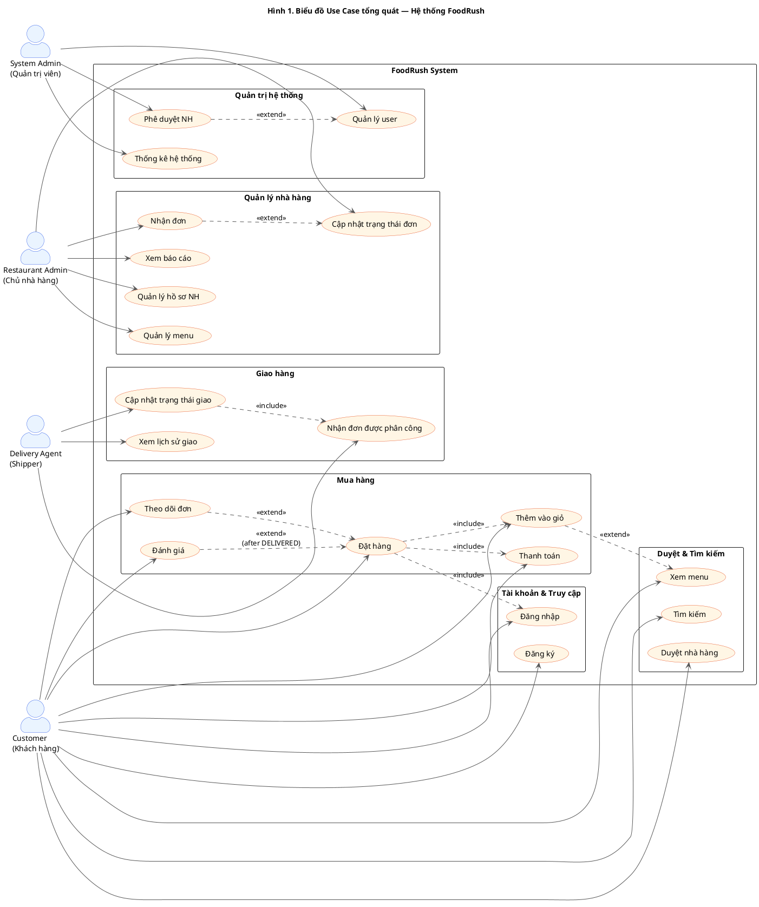
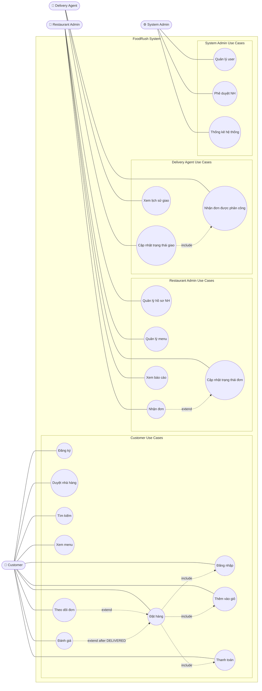

# Hình 1. Biểu đồ Use Case tổng quát — FoodRush

> **Hệ thống:** FoodRush (Ứng dụng đặt đồ ăn online)
> **Phạm vi:** Toàn bộ hệ thống — 4 actor chính
> **Format chính:** PlantUML (paste vào https://www.plantuml.com/plantuml/ hoặc dùng plugin IntelliJ / VS Code "PlantUML")

---

## 1. PlantUML — Use Case Diagram (Bản chính thức)



---

## 2. ASCII Diagram (Xem nhanh)

```
                              ┌──────────────────────────────────────────────────────┐
                              │                  FoodRush System                       │
                              │                                                        │
                              │  ╔═══ Tài khoản & Truy cập ═══════════════════╗        │
                              │  ║ (Đăng ký)        (Đăng nhập)               ║        │
                              │  ╚════════════════════════════════════════════╝        │
                              │                                                        │
                              │  ╔═══ Duyệt & Tìm kiếm ═══════════════════════╗        │
                              │  ║ (Duyệt nhà hàng) (Tìm kiếm) (Xem menu)     ║        │
                              │  ╚════════════════════════════════════════════╝        │
                              │                                                        │
       ┌─────────────┐        │  ╔═══ Mua hàng ═══════════════════════════════╗        │
       │   Customer  │────────▶  ║ (Thêm vào giỏ) ──include──▶ (Đặt hàng) ────║        │
       │ (Khách hàng)│        │  ║                                  │         ║        │
       └─────────────┘        │  ║                  include ─────── │         ║        │
                              │  ║                       ▼                    ║        │
                              │  ║                  (Thanh toán)              ║        │
                              │  ║                                            ║        │
                              │  ║  (Theo dõi đơn) extend (Đặt hàng)          ║        │
                              │  ║  (Đánh giá) extend after DELIVERED         ║        │
                              │  ╚════════════════════════════════════════════╝        │
                              │                                                        │
       ┌──────────────────┐   │  ╔═══ Quản lý nhà hàng ═══════════════════════╗        │
       │ Restaurant Admin │───▶  ║ (Quản lý hồ sơ NH)  (Quản lý menu)         ║        │
       │  (Chủ nhà hàng)  │   │  ║ (Nhận đơn) ───extend──▶ (Cập nhật trạng    ║        │
       └──────────────────┘   │  ║                          thái đơn)         ║        │
                              │  ║ (Xem báo cáo)                              ║        │
                              │  ╚════════════════════════════════════════════╝        │
                              │                                                        │
       ┌─────────────────┐    │  ╔═══ Giao hàng ══════════════════════════════╗        │
       │ Delivery Agent  │────▶  ║ (Nhận đơn được phân công) ──include──▶    ║        │
       │    (Shipper)    │    │  ║ (Cập nhật trạng thái giao)                 ║        │
       └─────────────────┘    │  ║ (Xem lịch sử giao)                         ║        │
                              │  ╚════════════════════════════════════════════╝        │
                              │                                                        │
       ┌─────────────────┐    │  ╔═══ Quản trị hệ thống ══════════════════════╗        │
       │  System Admin   │────▶  ║ (Quản lý user) ◀──extend── (Phê duyệt NH)  ║        │
       │  (Quản trị viên)│    │  ║ (Thống kê hệ thống)                        ║        │
       └─────────────────┘    │  ╚════════════════════════════════════════════╝        │
                              │                                                        │
                              └──────────────────────────────────────────────────────┘
```

---

## 3. Bảng tổng hợp Actor & Use Case

| Actor | Mã | Use Case | Mô tả nghiệp vụ |
|---|---|---|---|
| **Customer** | UC-C01 | Đăng ký | Tạo tài khoản mới, gửi email verification |
| | UC-C02 | Đăng nhập | Xác thực bằng email + password → JWT |
| | UC-C03 | Duyệt nhà hàng | Liệt kê + filter (city, cuisine, open, geo) |
| | UC-C04 | Tìm kiếm | Search NH theo tên/từ khoá |
| | UC-C05 | Xem menu | Hiển thị danh mục + món + giá |
| | UC-C06 | Thêm vào giỏ | Add món (1 user — 1 cart — 1 NH) |
| | UC-C07 | Đặt hàng | Tạo Order từ cart, sinh `FR-yyyyMMdd-00001` |
| | UC-C08 | Thanh toán | Chọn COD/MoMo/ZaloPay/Credit Card |
| | UC-C09 | Theo dõi đơn | Real-time STOMP `/user/queue/orders/{id}/status` |
| | UC-C10 | Đánh giá | 1 review/order, sau khi DELIVERED |
| **Restaurant Admin** | UC-R01 | Quản lý hồ sơ NH | Update thông tin NH + operating hours |
| | UC-R02 | Quản lý menu | CRUD category + menu item |
| | UC-R03 | Nhận đơn | Xem order PENDING của NH |
| | UC-R04 | Cập nhật trạng thái đơn | PENDING→CONFIRMED→PREPARING→READY_FOR_PICKUP |
| | UC-R05 | Xem báo cáo | Dashboard doanh thu, số đơn |
| **Delivery Agent** | UC-D01 | Nhận đơn được phân công | Accept đơn READY_FOR_PICKUP, gán shipper |
| | UC-D02 | Cập nhật trạng thái giao | PICKED_UP → ON_THE_WAY → DELIVERED |
| | UC-D03 | Xem lịch sử giao | Danh sách đơn đã hoàn thành |
| **System Admin** | UC-A01 | Quản lý user | Active/deactive tài khoản, role |
| | UC-A02 | Phê duyệt NH | Approve NH mới đăng ký |
| | UC-A03 | Thống kê hệ thống | Báo cáo tổng quan toàn nền tảng |

---

## 4. Quan hệ Include / Extend

| Quan hệ | Use case | Giải thích |
|---|---|---|
| `Đặt hàng` ─include→ `Đăng nhập` | Bắt buộc đã đăng nhập mới đặt được |
| `Đặt hàng` ─include→ `Thêm vào giỏ` | Đơn được build từ giỏ |
| `Đặt hàng` ─include→ `Thanh toán` | Mỗi đơn phải tạo record Payment |
| `Theo dõi đơn` ─extend→ `Đặt hàng` | Sau khi có đơn mới track được |
| `Đánh giá` ─extend→ `Đặt hàng` | Chỉ active sau khi đơn `DELIVERED` |
| `Thêm vào giỏ` ─extend→ `Xem menu` | Có thể add từ ItemDetail trong menu |
| `Cập nhật trạng thái đơn` ─extend→ `Nhận đơn` | Owner sau khi nhận đơn sẽ chuyển trạng thái |
| `Cập nhật trạng thái giao` ─include→ `Nhận đơn được phân công` | Shipper phải nhận đơn trước khi update |
| `Phê duyệt NH` ─extend→ `Quản lý user` | Phê duyệt cũng là một tác vụ quản lý user role |

---

## 5. Mermaid (Alternative — Github render trực tiếp)

> Mermaid chưa hỗ trợ use case diagram chính thức, dùng `flowchart` mô phỏng. Khuyến nghị dùng PlantUML ở mục 1 cho chuẩn UML.



---

## Cách render

| Tool | Cách dùng |
|---|---|
| **PlantUML online** | Copy block code `@startuml ... @enduml` ở mục 1 → paste vào https://www.plantuml.com/plantuml/uml/ → Submit |
| **VS Code** | Cài extension "PlantUML" (jebbs.plantuml) → mở file `.md` này → Alt+D xem preview |
| **IntelliJ IDEA** | Cài plugin "PlantUML integration" → trỏ chuột vào code block → click 👁 |
| **Mermaid** | GitHub render trực tiếp khi push lên repo, hoặc dùng https://mermaid.live |
| **CLI** | `plantuml USE_CASE_DIAGRAM.md` (xuất PNG/SVG) |
