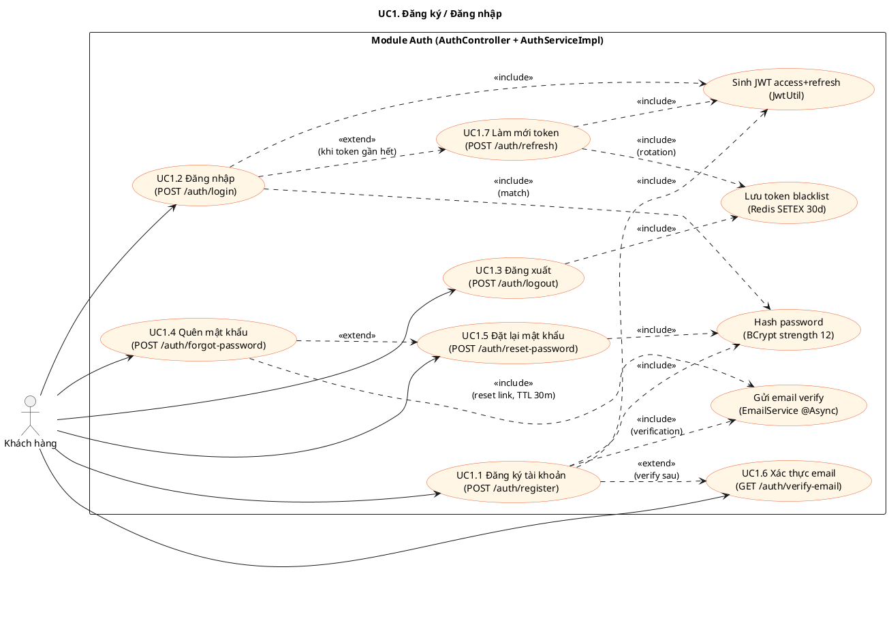
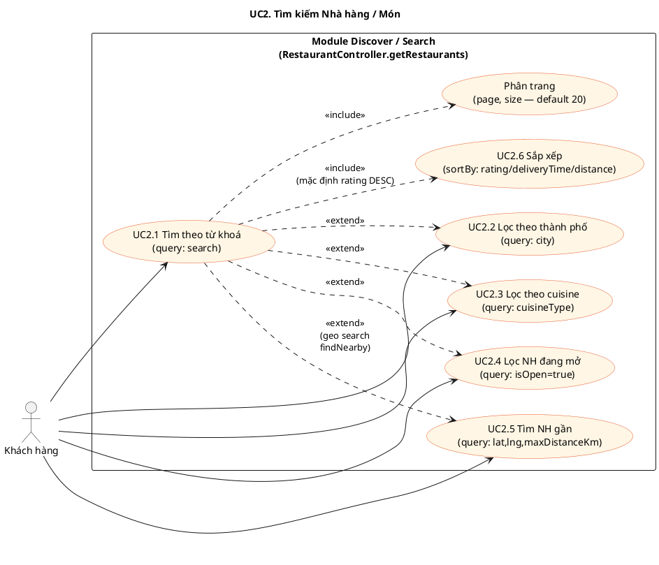
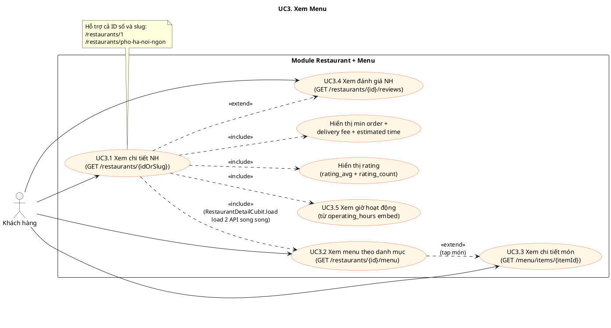
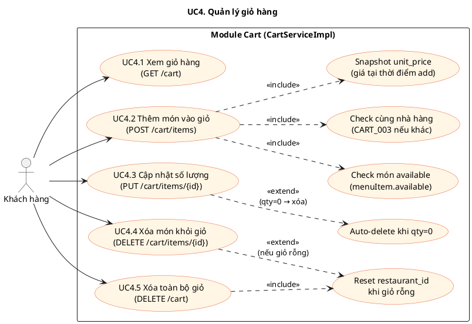
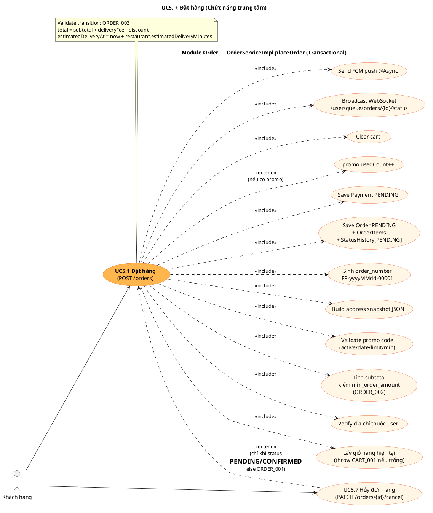
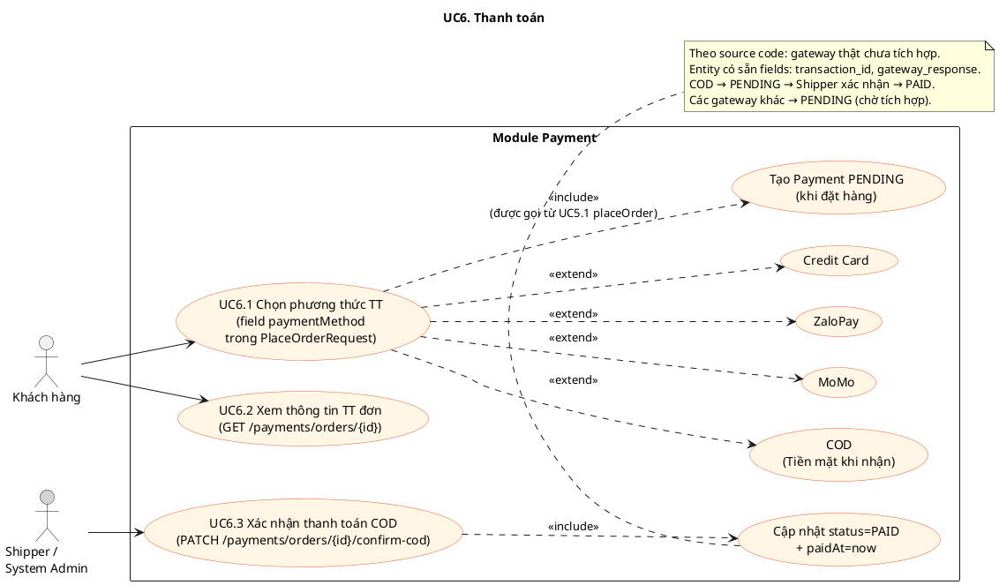
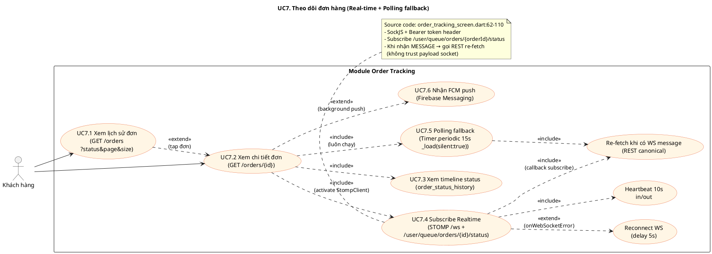
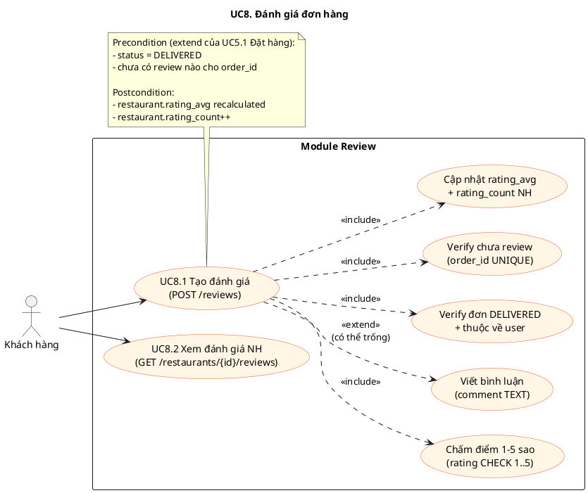

# 8 Use Case Khách hàng — Phân rã chi tiết theo Source Code

> Mỗi diagram dưới đây **map 1-1 với API endpoint thực tế** (Spring Boot Controller) và **logic Cubit/Repository** trong Flutter.
> Render tại https://www.plantuml.com/plantuml/uml/ (paste code giữa `@startuml ... @enduml`).

---

## UC1. Đăng ký / Đăng nhập

> **Backend:** `auth/controller/AuthController.java`, `auth/service/AuthServiceImpl.java`
> **Frontend:** `features/auth/data/auth_repository.dart`, `features/auth/logic/auth_cubit.dart`
> **API:** `/api/v1/auth/**`

**Error codes:** `AUTH_003` Email đã dùng · `AUTH_004` Phone đã dùng · `AUTH_005` Reset token sai · `AUTH_006` Reset token hết hạn · `AUTH_007` Verify token sai · `AUTH_008` Email đã verify

---

## UC2. Tìm kiếm Nhà hàng / Món

> **Backend:** `restaurant/controller/RestaurantController.java::getRestaurants(...)`
> **Frontend:** `features/discover/data/restaurant_repository.dart::fetchRestaurants(...)`
> **API:** `GET /api/v1/restaurants?city&cuisineType&search&isOpen&lat&lng&maxDistanceKm&page&size&sortBy`

**Logic:** Nếu có `lat & lng` → `RestaurantRepository.findNearby` (haversine + filter). Ngược lại → `findWithFilters`.

---

## UC3. Xem menu

> **Backend:** `restaurant/controller/RestaurantController` + `menu/controller/MenuController`
> **Frontend:** `features/restaurant/logic/restaurant_detail_cubit.dart`
> **API:** `GET /restaurants/{idOrSlug}` · `GET /restaurants/{id}/menu` · `GET /restaurants/{id}/menu/items/{itemId}` · `GET /restaurants/{id}/reviews`

---

## UC4. Quản lý giỏ hàng

> **Backend:** `cart/controller/CartController.java`, `cart/service/CartServiceImpl.java`
> **Frontend:** `features/cart/data/cart_repository.dart`, `features/cart/logic/cart_cubit.dart`
> **DB constraint:** `carts.user_id UNIQUE` — 1 user — 1 cart — 1 NH

**Error codes:** `CART_001` Giỏ trống · `CART_002` Món không available · `CART_003` Khác nhà hàng

---

## UC5. ⭐ ĐẶT HÀNG (Trung tâm)

> **Backend:** `order/controller/OrderController.java`, `order/service/OrderServiceImpl.java::placeOrder`
> **Frontend:** `features/order/presentation/screens/checkout_screen.dart`
> **API:** `POST /api/v1/orders` · `PATCH /api/v1/orders/{id}/cancel`
> **Transactional:** Toàn bộ flow đặt hàng nằm trong 1 `@Transactional`

**Error codes:** `CART_001` Giỏ trống · `ORDER_002` Dưới min order · `ORDER_001` Không thể huỷ · `ORDER_003` Status transition sai · `FORBIDDEN` Đơn không phải của user

---

## UC6. Thanh toán

> **Backend:** `payment/controller/PaymentController.java`, `payment/service/PaymentServiceImpl.java`
> **Entity:** `Payment` (1:1 với Order — `payments.order_id UNIQUE`)
> **Enum:** `PaymentMethod{COD, CREDIT_CARD, MOMO, ZALOPAY}` · `PaymentStatus{PENDING, PAID, FAILED, REFUNDED}`

---

## UC7. Theo dõi đơn hàng

> **Backend:** `order/controller/OrderController` (GET) + `WebSocketConfig` (STOMP) + `NotificationServiceImpl` (FCM)
> **Frontend:** `features/order/presentation/screens/order_tracking_screen.dart`
> **API REST:** `GET /orders` · `GET /orders/{id}`
> **WebSocket:** `/ws` (SockJS) → `/user/queue/orders/{id}/status`

**Trạng thái UI:** Badge "Realtime: Đang kết nối" (xanh) hoặc "Mất kết nối (đang dùng polling)" (cam).

---

## UC8. Đánh giá đơn hàng

> **Backend:** `review/controller/ReviewController.java`, `review/service/ReviewServiceImpl.java`
> **Frontend:** `features/review/data/review_repository.dart`
> **DB constraint:** `reviews.order_id UNIQUE` · `rating CHECK 1..5`
> **Precondition:** Order phải có `status = DELIVERED`

---

## Tổng hợp ánh xạ Use Case ↔ Source Code

| Use Case | API endpoint | Backend service | Frontend repository/screen |
|---|---|---|---|
| **UC1** Đăng ký/Đăng nhập | `POST /auth/{register,login,refresh,logout,forgot-password,reset-password}` · `GET /auth/verify-email` | `AuthServiceImpl` | `AuthRepository` + `AuthCubit` + 5 auth screens |
| **UC2** Tìm kiếm | `GET /restaurants?city&cuisine&search&isOpen&lat&lng&maxDistanceKm&sortBy` | `RestaurantServiceImpl.getRestaurants` | `RestaurantRepository.fetchRestaurants` + `DiscoverCubit` + `SearchScreen` |
| **UC3** Xem menu | `GET /restaurants/{id}` · `/menu` · `/menu/items/{itemId}` · `/reviews` | `RestaurantServiceImpl` + `MenuServiceImpl` | `RestaurantDetailCubit` + `RestaurantDetailScreen` + `ItemDetailScreen` |
| **UC4** Giỏ hàng | `GET /cart` · `POST /cart/items` · `PUT/DELETE /cart/items/{id}` · `DELETE /cart` | `CartServiceImpl` | `CartRepository` + `CartCubit` + `CartScreen` |
| **UC5** Đặt hàng ⭐ | `POST /orders` · `PATCH /orders/{id}/cancel` | `OrderServiceImpl.placeOrder` (transactional) | `OrderRepository` + `CheckoutScreen` + `OrderDetailScreen` |
| **UC6** Thanh toán | `GET /payments/orders/{id}` · `PATCH /payments/orders/{id}/confirm-cod` | `PaymentServiceImpl` | `OrderRepository.getPaymentByOrder` |
| **UC7** Theo dõi | `GET /orders` · `GET /orders/{id}` · STOMP `/ws` + `/user/queue/orders/{id}/status` | `OrderServiceImpl` + `WebSocketConfig` + `NotificationServiceImpl` | `OrderRepository` + `OrderHistoryScreen` + **`OrderTrackingScreen`** (StompClient + Timer) |
| **UC8** Đánh giá | `POST /reviews` · `GET /restaurants/{id}/reviews` | `ReviewServiceImpl.createReview` | `ReviewRepository` + Review dialog trong `OrderHistoryScreen` |

---

## Cách dùng

1. Copy nguyên block `@startuml ... @enduml` của diagram cần render
2. Paste vào https://www.plantuml.com/plantuml/uml/
3. Click **Submit** → diagram hiển thị, có thể export PNG/SVG

**VS Code:** cài plugin `jebbs.plantuml`, mở file `.md` này, gõ `Alt+D` để preview tất cả diagram.
