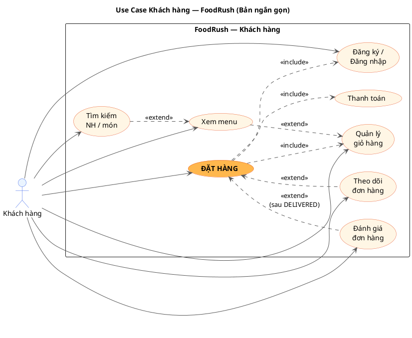

# Use Case Phân rã — Khách hàng (Bản ngắn gọn)

> **Phạm vi:** 8 use case cốt lõi của Khách hàng.
> **Trung tâm:** `Đặt hàng` với 3 quan hệ `include` + 2 quan hệ `extend`.

---

## 1. PlantUML



---

## 2. ASCII xem nhanh

```
                              ┌────────────────────────────────────────┐
                              │       FoodRush — Khách hàng             │
                              │                                         │
                              │   (Đăng ký / Đăng nhập)                  │
                              │           ▲                              │
                              │           │ «include»                    │
                              │           │                              │
   ┌────────────┐              │   (Tìm kiếm) ──«extend»──▶ (Xem menu)   │
   │ Khách hàng │──────────────▶                              │           │
   └────────────┘              │                              │«extend»  │
                              │                              ▼           │
                              │                       (Quản lý giỏ hàng) │
                              │                              ▲           │
                              │                              │ «include» │
                              │                              │           │
                              │                    ╔══════════════════╗  │
                              │                    ║   ĐẶT HÀNG ⭐    ║  │
                              │                    ╚════════╤═════════╝  │
                              │                              │ «include»  │
                              │                              ▼           │
                              │                        (Thanh toán)      │
                              │                                          │
                              │      «extend»                            │
                              │   ┌────────────▶ (Theo dõi đơn hàng)    │
                              │   │                                       │
                              │   │  «extend» (sau DELIVERED)             │
                              │   └────────────▶ (Đánh giá đơn hàng)    │
                              └────────────────────────────────────────┘
```

---

## 3. sequencediagram.org format

```
title Use Case Khách hàng — FoodRush (Bản ngắn gọn)

actor "Khách hàng" as KH
participant "FoodRush System" as Sys

KH->Sys: Đăng ký / Đăng nhập
KH->Sys: Tìm kiếm NH / món
KH->Sys: Xem menu
KH->Sys: Quản lý giỏ hàng

KH->Sys: **ĐẶT HÀNG**
note over KH,Sys: «include»:\n- Đăng ký / Đăng nhập\n- Quản lý giỏ hàng\n- Thanh toán

KH->Sys: Thanh toán

KH->Sys: Theo dõi đơn hàng
note over KH,Sys: «extend» Đặt hàng

KH->Sys: Đánh giá đơn hàng
note over KH,Sys: «extend» Đặt hàng (sau DELIVERED)
```

---

## 4. Bảng quan hệ

| Use case | Quan hệ | Use case liên quan | Ý nghĩa |
|---|---|---|---|
| Đặt hàng | **«include»** | Đăng ký / Đăng nhập | Bắt buộc đã xác thực |
| Đặt hàng | **«include»** | Quản lý giỏ hàng | Đơn build từ giỏ |
| Đặt hàng | **«include»** | Thanh toán | Mỗi đơn phải có Payment |
| Tìm kiếm | «extend» | Xem menu | Từ kết quả → xem chi tiết |
| Xem menu | «extend» | Quản lý giỏ hàng | Thêm món vào giỏ |
| Theo dõi đơn | **«extend»** Đặt hàng | — | Realtime WS + FCM sau khi đặt |
| Đánh giá đơn | **«extend»** Đặt hàng | — | Chỉ sau khi `status = DELIVERED` |

---

## 5. Hướng dẫn render

| Tool | URL |
|---|---|
| PlantUML | https://www.plantuml.com/plantuml/uml/ |
| sequencediagram.org | https://sequencediagram.org/ |
